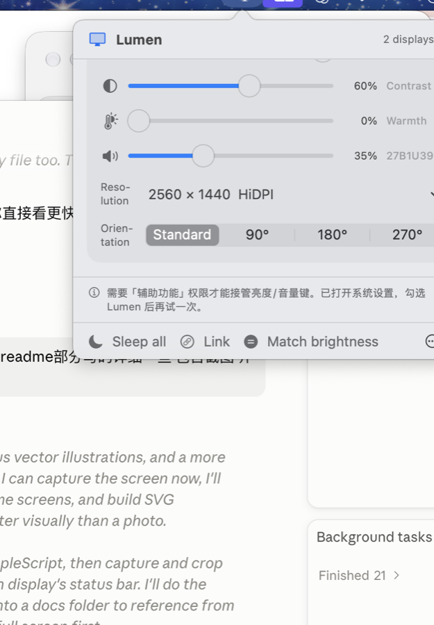

<p align="center">
  
</p>

<h1 align="center">PWE Lumen Bar</h1>

<p align="center">
  <a href="README.en.md">English</a> · 中文<br>
  <sub>macOS 菜单栏显示器控制器 · 仅支持 Apple Silicon（M 系列）· macOS 26 / 27</sub>
</p>

---

一块屏一张卡片。亮度、对比度、色温、音量、分辨率、方向、输入源、开关、截图 —— 每块屏单独控制，包括 MacBook 自己的屏幕。

<p align="center">
  
</p>

```bash
./scripts/build-app.sh
cp -R build/PWE Lumen Bar.app /Applications/ && open /Applications/PWE Lumen Bar.app
```

点菜单栏图标打开面板；**在图标上滚轮**直接调节光标所在屏的亮度，不用开面板；**右键**切换场景。

---

## 先说一件事：为什么你的 4K 显示器不如笔记本屏清楚

这是大多数人接上外接显示器后的第一感受，而且几乎没人被告知过原因。

<p align="center">
  
</p>

**macOS 只有 1 倍和 2 倍两种渲染方式**，没有 Windows 那样的任意比例缩放。要让文字锐利，它必须先按 2 倍渲染，再缩到显示器的实际分辨率输出 —— 这就是 Retina 屏字好看的原因。

一台 27 吋 4K 显示器约 163 PPI，恰好卡在中间：

- **1 倍跑 3840×2160** —— 锐利，但界面小到费眼
- **2 倍跑 1920×1080** —— 锐利，但界面大得浪费了这块 4K 屏
- **「看起来像 2560×1440」** —— 大小正好，但需要显示器**主动报告**这一档 HiDPI 模式

很多显示器不报告第三档。macOS 于是只能把一个非原生分辨率拉伸到面板上，每个像素都重采样一次 —— 那点「糊」就是这么来的，而显示器本身完全没有问题。

PWE Lumen Bar 做两件事：把系统藏起来的 HiDPI 模式**挖出来**（免费），以及在显示器压根不报告时把它们**补进去**（Pro，需管理员密码 + 重启，随时可移除）。

---

## 功能

### 每块屏单独控制

| | 内建屏 | 外接屏 | 走哪条路 |
|---|---|---|---|
| 亮度 | ✅ | ✅ | `DisplayServices` → DDC `0x10` → gamma 软件调光，三级降级 |
| 对比度 | — | ✅ | DDC `0x12` |
| 色温 | ✅ | ✅ | gamma 曲线，与软件调光合成同一张表 |
| 音量 / 静音 | ✅ | ✅ | CoreAudio 设备匹配 → DDC `0x62` / `0x8D` |
| 分辨率 / HiDPI | ✅ | ✅ | 私有 CGS 模式表，公开 API 兜底 |
| 刷新率 | ✅ | ✅ | 同上，低于 50Hz 的「孪生档」自动隐藏 |
| 方向旋转 | ✅ | ✅ | SkyLight `SLSSetDisplayRotation` |
| 输入源 | — | ✅ | DDC `0x60`，**可选值由显示器 capabilities 提供**，不是硬编码 |
| 关闭 / 点亮 | ✅ | ✅ | 软断开，永远可逆 |
| 截图 | ✅ | ✅ | ScreenCaptureKit，按完整像素分辨率 |
| 颜色配置文件 | ✅ | ✅ | ColorSync |
| EDID 读取 / 导出 | — | ✅ | I2C `0x50` |

分辨率列表只给 5 档，按默认档的倍数取，并按面板宽高比过滤 —— 和系统设置给的**逐项一致**，不会混进 4:3 的档位让 16:9 的屏加黑边。

### 多屏协同

- **联动亮度** —— 拖动任意一块屏，其余按开启那一刻的比例一起动，**保留各屏之间的差异**
- **统一亮度** —— 把所有屏拉到同一个值。和联动是两件事：联动保差异，统一抹平差异
- **跟随内建屏** —— 外接屏按比例跟随内建屏的环境光自动调节
- **场景预设** —— 存下整套状态（亮度/对比度/色温/音量/分辨率/方向/位置/颜色配置），一键切回
- **配置锁定** —— 外部对分辨率或方向的改动会被自动还原
- **记住每块屏** —— 插拔后自动恢复

### 不用打开面板

- **菜单栏图标滚轮** —— 调节光标所在屏的亮度
- **接管系统亮度键** —— F1/F2 直接作用于**光标所在**的外接屏；光标在内建屏上时交还 macOS，保留原生 HUD
- **音量键跟的是声音，不是光标** —— 见下面「音量键为什么不看光标」
- **全局快捷键** —— `⌃⌥↑↓` 亮度、`⌃⌥←→` 音量、`⌃⌥M` 静音、`⌃⌥S` 截图、`⌃⌥P` 熄屏，可改绑
- **调节 OSD** —— 显示在**被调节的那块屏**上，补上 DDC 调节完全没有反馈的空白

#### 音量键为什么不看光标

亮度是显示器的属性，音量不是 —— 音量是**当前输出设备**的属性。

如果照着「调光标所在那块屏」的规则做，你戴着 AirPods、光标停在外接屏上按音量键，PWE Lumen Bar 会去调那台显示器扬声器的音量：HUD 动了，进度条动了，你听到的声音一点没变。**一个调了等于没调的音量条，比没有音量条更糟。**

所以规则是一句话：**只有当系统输出正是某台外接显示器自己的扬声器时，PWE Lumen Bar 才接管音量键；走蓝牙、AirPlay、内建扬声器或外置声卡时，按键原样交还 macOS**，由系统去调真正在发声的设备，连原生 HUD 和「调音量时播放反馈」的那声轻响都保留。

接管的那种情况反而是系统做不好的：DisplayPort 音频端点经常**根本不暴露音量控制**（本机这台 Philips 27B1U3900 就是），系统音量键按下去毫无反应，而 DDC 的 VCP `0x62` 完全可用。这时 PWE Lumen Bar 接管，键就活了 —— 并且会自己补上那声反馈音，因为按键被吃掉之后 macOS 不会再播。

菜单里也一并说清楚：某块屏的扬声器不是当前输出时，音量滑块下面直接写着**声音正在哪里**。滑块照样能用（可以先把显示器音量预设好再切过去），但它不会假装你听得到。

```bash
pwelumenctl audio      # 列出输出设备，标出当前输出，并直接告诉你音量键归谁
```

### 显示器信息

设置里可以展开每块屏的完整信息：物理尺寸、原生分辨率、PPI、白点、色彩空间、最高位深、信号编码、HDR 状态、DSC、EDID 厂商与型号。

HDR 分两件事说清楚：**链路能不能传 HDR 信号**，和 **macOS 有没有给出 EDR 余量**。只有后者决定 HDR 是否真的可用。

---

## 三个安全设计

都是事故换来的，改代码时请守住：

1. **改分辨率和改方向都走 15 秒确认回滚**，不点「保留」自动恢复。被新操作顶掉时**回滚**而不是静默丢弃 —— 显示不出来的模式在菜单栏应用里是不可恢复的，菜单本身就在那块黑掉的屏上。
2. **会让显示器脱离系统的操作必须先确认** —— DDC 断电和切换输入源都只能靠显示器的物理按键恢复。「熄屏」一律走软断开，永远可逆。
3. **软件调光在退出时一定恢复**。gamma 修改是进程外生效的，不还原就会留下一块永远偏暗、又没有界面能调回来的屏。

---

## 自动化

`pwelumen://` URL scheme，可在「快捷指令」的「打开 URL」里调用：

```
pwelumen://brightness?display=cursor&value=60     显示器可写 cursor / main / builtin / ID / 名字片段
pwelumen://brightness?display=main&delta=-10      相对调整
pwelumen://contrast?display=main&value=55         pwelumen://warmth?display=2&value=40
pwelumen://volume?display=LG&value=30             pwelumen://mute?display=main&state=toggle
pwelumen://link?state=on                          pwelumen://matchbrightness?display=2
pwelumen://preset?name=工作                        pwelumen://rotate?display=2&angle=90
pwelumen://mode?display=main&id=cgs:3             pwelumen://input?display=LG&source=hdmi1
pwelumen://off?display=2   pwelumen://on             pwelumen://main?display=2
pwelumen://arrange?tile    pwelumen://sleep          pwelumen://refresh   pwelumen://settings
```

参数错误、找不到显示器、命令不存在，都会在主屏弹出提示并写明来源 —— 自动化是从「快捷指令」触发的，把错误只写进菜单状态栏等于没写。

**截图刻意不开放给 URL scheme**：任何网页或程序都能打开自定义 URL，而 PWE Lumen Bar 持有录屏权限，把 capture 放进来等于给外部静默截屏的能力。

---

## 为什么 HiDPI 必须用私有 API

在 macOS 27 / M1 上，公开的 `CGDisplayCopyAllDisplayModes` 对内建屏**只返回 3 个模式，而且连当前正在使用的那个都不在里面**：

```
公开 API:  2560×1600 1x   2048×1280 1x   1920×1200 1x
私有 CGS:  960×600 2x   1024×640 2x   1280×800 2x   1440×900 2x ←当前
           1680×1050 2x   1920×1200 1x   2048×1280 1x   2560×1600 1x
```

文档里的 `kCGDisplayShowDuplicateLowResolutionModes` 选项在这版系统上**完全没有效果**。所有 HiDPI 档只存在于窗口服务器自己的模式表里，只能通过 `CGSGetDisplayModeDescriptionOfLength` 读出来。

结构体字段偏移是实测确认的（`Sources/LumenBarCore/CGSModeTable.swift`）：

| 偏移 | 字段 |
|---|---|
| 0 / 4 | 模式号 / 标志位（沿用 IOKit 的 valid·safe·default·native 语义） |
| 8 / 12 | 逻辑宽高 |
| 36 / 40 | 刷新率 / DPI |
| **184** | **结构体自身长度 = 212** |
| 200 / 204 / 208 | 像素宽高 / 缩放倍率 (float) |

偏移 184 处的自述长度是**版本护栏**：读回来不等于 212 就说明 Apple 改了布局，整条私有路径自动放弃、退回公开 API，而不是拿着错位的内存当分辨率用。

## 旋转：一条走错的路，和一个被验证是错的结论

第一版用 IOKit 的 `IOServiceRequestProbe(kIOFBSetTransform)` —— 那是 **Intel 时代**的路径。它在 M1 上对**每一块屏**都返回 `kIOReturnUnsupported`，于是我一度得出「内建屏不支持旋转」的结论。

那个结论是错的。正确路径是 SkyLight 的 `SLSSetDisplayRotation(displayID, degrees)`（不带 connection id）。换过来之后**内建屏和外接屏都能正常旋转**，只是 macOS 在系统设置里把内建屏的选项藏了起来。

同时 `kCGDisplaySupportsRotation` 对内建屏虚报 `true`。两个 API 一个说能一个说不能，**都不可信** —— 只有换对 API 之后的实际结果才算数。

## 一次代价真实的教训：DDC 断电不可逆

第一版把「熄屏」实现成优先走 DDC 电源指令（`0xD6 = 0x05`），因为那样能真正让显示器断电。在 Philips 27B1U3900 上，断电之后显示器**不仅从 CoreGraphics 消失，连它的 `DCPAVServiceProxy` 也一起消失了** —— I2C 通道没了，就没有任何途径把开机指令送回去，只能去按显示器的物理电源键。

现在「熄屏」一律走软断开，永远可逆。DDC 断电降级成显式菜单项并带确认弹窗；**切换输入源**属于同一类风险，也加了同样的确认。

## 命令行

`pwelumenctl` 与界面**共用同一套引擎和同一份设置** —— 在菜单里存的场景，命令行能读到；命令行锁定的显示器，运行中的 app 会执行。

```bash
pwelumenctl                             # 用法（--verbose 打开引擎调试输出，--lang zh|en 切语言）
pwelumenctl diag                        # 每块屏走哪条通道
pwelumenctl modes 2 --all               # 全部模式，HiDPI 分组
pwelumenctl set-mode 2 cgs:61 --revert 3   # 切换并 3 秒后自动回滚
pwelumenctl brightness 2 70             # 0-100，越界或非数字直接报错并 exit 1
pwelumenctl warmth 2 40                 # 色温
pwelumenctl link / matchbrightness      # 见 URL scheme
pwelumenctl follow 2 on                 # 外接屏跟随内建屏亮度
pwelumenctl protect 2 on                # 锁定分辨率和方向
pwelumenctl name 2 "左侧 4K"             # 重命名（- 恢复系统名称）
pwelumenctl details 2                   # 完整信息：PPI / HDR / 色彩空间 / EDID
pwelumenctl caps 2                      # 显示器自报的 DDC capabilities
pwelumenctl edid 2 ~/Desktop/mon.bin    # 导出 EDID
pwelumenctl hidpi 2 show                # 预览强制 HiDPI 会写什么（不安装）
pwelumenctl preset save 工作 / apply 工作
pwelumenctl off 2 / on                  # 关闭 / 点亮单块屏
pwelumenctl log 50                      # 诊断日志，app 与 CLI 共写
pwelumenctl audio                       # 输出设备 + 当前输出 + 音量键归属
pwelumenctl compat                      # 系统兼容性自检：私有接口一项一项验
```

## 结构

```
LumenBarCore/   引擎，无 UI，可命令行完整驱动
  Dyn            私有符号一律 dlsym，取不到就降级，绝不在启动时崩
  Defaults       app 与 CLI 的共享设置域 —— 新增设置一律走它
  CGSModeTable   私有模式表 + 布局版本护栏
  ConnectionType 连接方式识别，决定 DDC 闸门
  DDC / DDCCapabilities   I2C 通道与显示器自报能力
  SignalInfo     HDR / EDR / 色彩空间 / 位深 / 信号编码
  Mode Brightness Audio Rotation Power Input Capture Color
  Arrangement Preset DisplayDetails HiDPIOverride
  SettingsStore DisplayNameStore LicenseStore
LumenBarUI/     菜单、控制器、快捷键、媒体键、OSD、设置窗、URL 命令
             StatusItemController 自管状态栏项（MenuBarExtra 收不到滚轮事件）
PWE Lumen Bar/       应用外壳（纯 AppKit）
pwelumenctl/    命令行
```

图标是矢量的：`scripts/make-icons.swift` 用同一套 Core Graphics 绘制代码导出 `AppIcon.pdf`、菜单栏的 `MenuBarIcon.pdf`（template，任意缩放不糊）和各尺寸 `.icns`。

## 系统支持：为什么是「26 / 27」，以及怎么自己验证

PWE Lumen Bar 自己的代码**不用任何高于 macOS 14 的 API** —— 包是按 14.0 的 deployment target 编译的，这条低地板就是防止新 API 悄悄溜进来的机制：真用了，编译期就过不去。

真正会随系统变的全在**私有接口**上：窗口服务器的模式表、SkyLight 的旋转、DisplayServices 的亮度、IOAVService 的 I2C 通道。这些一律在运行时用 `dlsym` 解析，改名只会让**对应的那一个能力**降级，不会让 app 起不来。

所以与其宣称一个版本区间然后祈祷，不如把接口本身查一遍：

```bash
pwelumenctl compat
```

```
✅  macOS                                 27.0.0 (26A5425a)
✅  Apple Silicon                         Apple M1
✅  CGSGetDisplayModeDescriptionOfLength  HiDPI mode list
✅  SLSSetDisplayRotation                 rotation
✅  IOAVServiceReadI2C                    DDC/CI
✅  CGS mode table                        212-byte layout confirmed…
```

设置 › 系统里有同一份报告。CGS 模式表那一项尤其关键：那个结构体**第 184 字节存着自己的长度**，所以布局是自校验的 —— 读回来不是 212 就说明 Apple 动过结构，PWE Lumen Bar 直接退回公开 API（失去强制 HiDPI），而不是照着错位的偏移读垃圾。

**26 与 27 用的是同一套私有接口和同一套 Apple Silicon 显示栈**，开发和验证在 27 上做，26 支持但没有实机跑过 —— `pwelumenctl compat` 五秒钟就能在你的机器上给出真实答案。Intel 机型不支持：DDC 走的 `IOAVService` 在 Intel Mac 上根本不存在，首次启动会明说一次。

## 已实测 / 未实测

**已在真机验证**（M1 MacBook Air / macOS 27，构建 26A5425a）：

| 显示器 | 结论 |
|---|---|
| 内建 Retina | 亮度、旋转、8 个模式（5 个 HiDPI） |
| Apple Studio Display 5K | 走 `DisplayServices`；**完全不响应 DDC** —— Apple 屏用自有协议 |
| Philips 27B1U3900 4K | DDC 亮度/对比度/音量/capabilities/EDID/输入源全部通过 |

另外已实测：分辨率切换与 15 秒回滚、旋转往返、单屏关闭点亮（在线数 2→1→2）、场景往返、配置锁定还原外部改动、跟随亮度按比例同步、联动亮度保差异、截图（5120×2880 完整像素）、EDID 导出、改名、镜像、排列、URL 自动化、授权激活。

另外已实测：音量键归属判定 —— 把系统输出切到 Philips，`pwelumenctl audio` 报「接管」；切回内建扬声器，报「交还 macOS」，两个方向都对。

**未实测**：DDC 多通道配对（需两台第三方显示器）、媒体键接管的**实际按键**（受 ad-hoc 签名影响，辅助功能授权每次重新构建就失效；归属判定本身已验证）、macOS 26 实机（`pwelumenctl compat` 可当场自检）。

`Colorimetry` / `PixelEncoding` 的枚举含义 IOKit 未公开，界面只报告能确定的部分，其余按原始值展示 —— 不凭猜测贴标签。

## 交接

完整交接文档见 [HANDOVER.md](HANDOVER.md)：API 陷阱、系统性缺陷的成因、Pro 授权机制、未决事项、安全约定。
