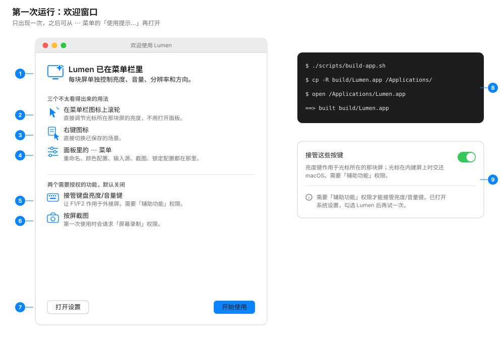
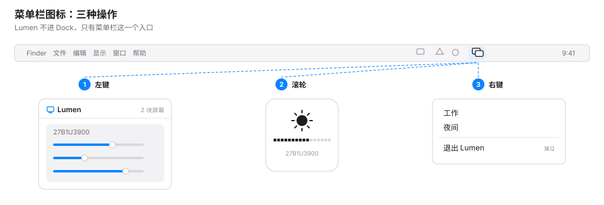
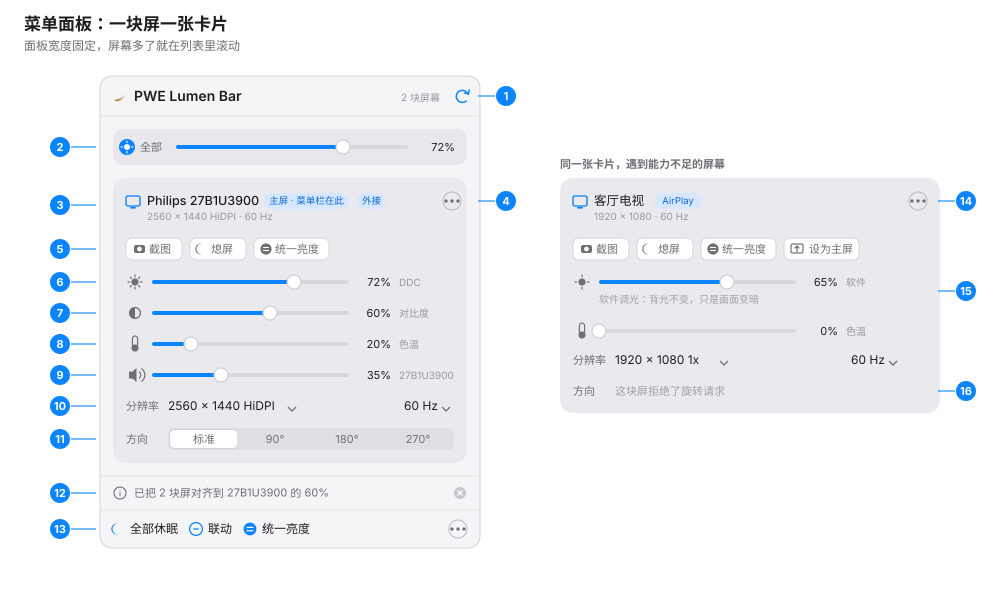
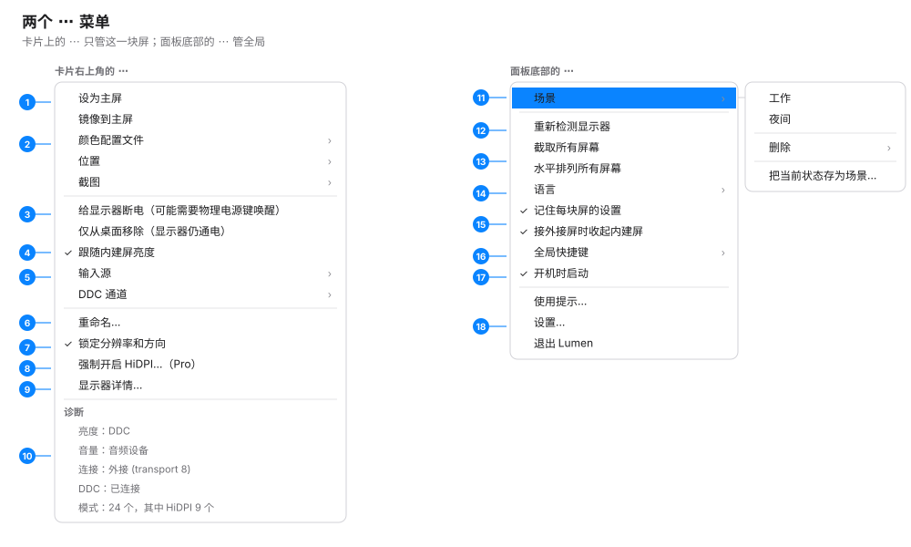
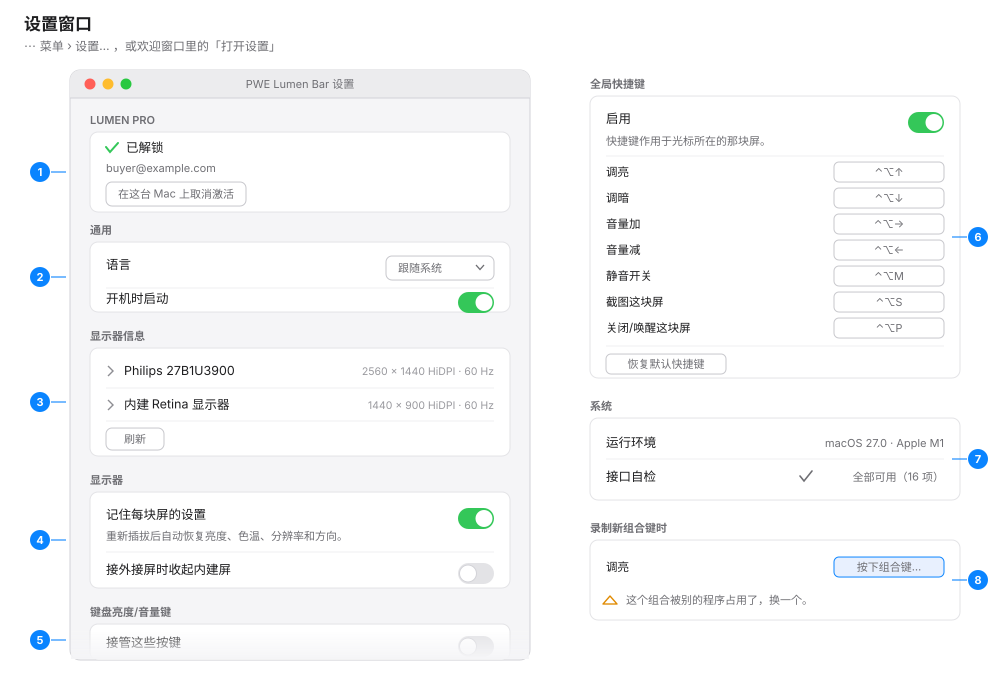
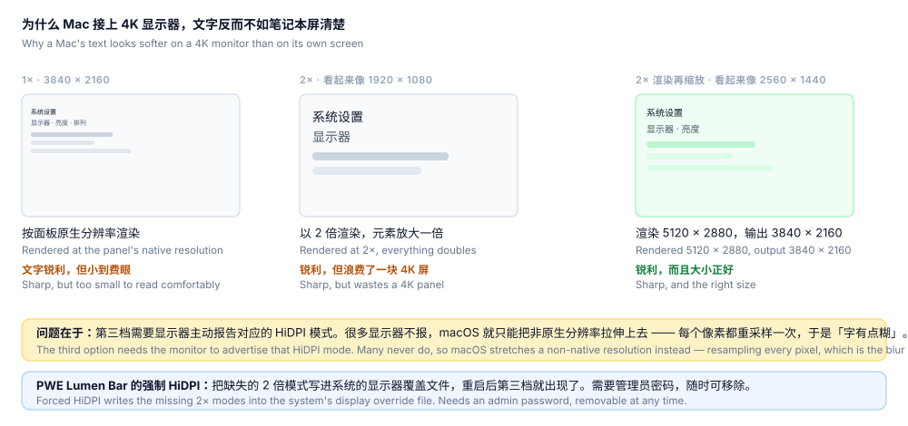
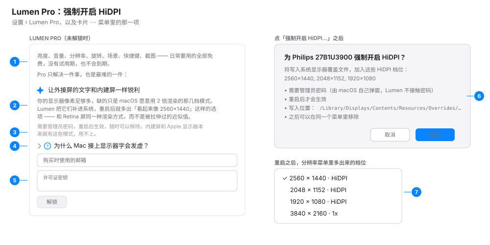

# PWE Lumen Bar User Guide

> English · [中文](GUIDE.md)
>
> This document is organised around **what you want to do**, with an annotated
> illustration for each screen. For how it works inside, read the
> [README](../README.en.md); to take over the code, read [HANDOVER](../HANDOVER.md).

PWE Lumen Bar is a macOS menu bar display controller: **one card per display**, with
brightness, contrast, colour temperature, volume, resolution, refresh rate,
orientation, input source, power and screenshots controlled per display —
including the MacBook's own panel.

**Apple Silicon (M-series) only.** The bundle declares macOS 26 as its floor and
is verified on macOS 27 / M1. Whether every private interface PWE Lumen Bar depends on
is present on *your* machine is something you can check yourself
(see [9. When something goes wrong](#9-when-something-goes-wrong)).

---

## Contents

1. [Installing and first run](#1-installing-and-first-run)
2. [The menu bar icon: three gestures](#2-the-menu-bar-icon-three-gestures)
3. [The panel, item by item](#3-the-panel-item-by-item)
4. [The two ⋯ menus](#4-the-two--menus)
5. [Everyday tasks](#5-everyday-tasks)
6. [The Settings window](#6-the-settings-window)
7. [PWE Lumen Bar Pro: forcing HiDPI on](#7-pwe-lumen-bar-pro-forcing-hidpi-on)
8. [The `pwelumenctl` command line](#8-the-pwelumenctl-command-line)
9. [When something goes wrong](#9-when-something-goes-wrong)

---

## 1. Installing and first run

```bash
./scripts/build-app.sh                 # → build/PWE Lumen Bar.app (builds pwelumenctl too)
cp -R build/PWE Lumen Bar.app /Applications/
open /Applications/PWE Lumen Bar.app
```

PWE Lumen Bar is an `LSUIElement` app: **no Dock icon and no window**. The only sign it
launched is a new menu bar icon (two overlapping displays).

The first run shows this window once. To see it again later:
**⋯ › Usage tips…** at the bottom of the panel.

<p align="center">
  
</p>

1. **Title area** — one sentence on what PWE Lumen Bar is for.
2. **Scroll on the menu bar icon** — adjusts the brightness of the display under
   the pointer without opening anything. Nothing in the interface hints at this,
   which is why it comes first.
3. **Right-click the icon** — apply a saved preset directly.
4. **The ⋯ menus in the panel** — rename, colour profile, input source,
   screenshot and configuration locking all live there; see
   [section 4](#4-the-two--menus).
5. **Taking over the keyboard brightness/volume keys** — off by default. Turning
   it on needs Accessibility permission; see the table below.
6. **Per-display screenshots** — macOS asks for Screen Recording permission the
   first time.
7. **Two buttons** — "Open Settings" goes straight to the settings window;
   "Get started" closes the window for good.
8. **Build and install** — the three commands above. `build-app.sh` also places
   `pwelumenctl` inside `PWE Lumen Bar.app/Contents/Resources/pwelumenctl`; the SwiftPM product
   is at `.build/release/pwelumenctl` (or `debug`).
9. **When permission is refused** — turning the key takeover on without the
   grant opens System Settings and says what to do next in the status line.

### What PWE Lumen Bar asks for, and why

| Permission | When it is needed | What happens without it |
|---|---|---|
| **Accessibility** | Only for "take over the keyboard brightness/volume keys" — it has to see F1/F2 before the system does | The toggle springs back off; everything else works normally |
| **Screen Recording** | The first screenshot | The capture fails with a message; nothing else is affected |
| **Administrator password** | Only when Pro's "force HiDPI on" writes the system override file | That one feature is unavailable; nothing else is affected |

**The global shortcuts (the ⌃⌥ set) need no Accessibility grant** — they go
through Carbon hot key registration. A menu bar utility should not have to ask
for control of the whole machine just to dim a screen.

---

## 2. The menu bar icon: three gestures

<p align="center">
  
</p>

1. **Left click** — opens the control panel (next section). Opening it re-detects
   the displays.
2. **Scroll** — adjusts the brightness of **the display under the pointer**, 2%
   per step, with no interface at all. A HUD appears on the display that moved.
3. **Right click** — a short menu that applies a saved preset, ending in
   "Quit PWE Lumen Bar". With no presets saved yet it says so.

---

## 3. The panel, item by item

<p align="center">
  
</p>

The panel has a fixed width and scrolls when there are many displays. On the
left is an external display whose DDC works; on the right is the same card on a
display that cannot do as much.

1. **Title bar** — how many displays were found. The ↻ re-detects the displays
   **and what they can do**: press it after changing a cable, a dock, or after
   enabling DDC/CI in the monitor's own menu.
2. **"All" master brightness** — appears only when **two or more displays have
   adjustable brightness**. Dragging it moves every display to the same value.
3. **Card title and badges** — the current resolution and refresh rate sit under
   the name. Badges appear as they apply:
   - `Main · menu bar here` — the menu bar and Dock are on this display
   - `Mirroring` — it is showing another display's picture
   - `Off` — PWE Lumen Bar switched it off
   - `Locked` — outside changes to resolution or orientation are reverted
   - `External` / `Built-in` / `AirPlay` / `Virtual` — the connection, which
     decides which controls this display can have at all
4. **The card's ⋯ menu** — everything else for this display; see
   [section 4](#4-the-two--menus).
5. **Quick buttons** — "Screenshot" and "Sleep", plus "Match brightness" when
   two or more displays are adjustable, plus "Make main" when it is not the main
   display. Hovering shows the matching shortcut; when shortcuts are off, the
   tooltip says so plainly instead of promising a combination that is not
   registered.
6. **Brightness** — the small label on the right is **the channel this slider
   actually drives**:
   - `System` — the system brightness interface, the same path as the keyboard
     brightness keys
   - `DDC` — the monitor's backlight, over DDC/CI
   - `Software` — the display accepts no hardware adjustment, so a colour curve
     dims the picture and **the backlight does not change** (the card says this
     under the slider)
7. **Contrast** — **appears only when DDC is available**. No contrast row means
   no DDC on this display.
8. **Warmth** — present on every display, because it is a gamma curve rather
   than a hardware control. Right is warmer. Night Shift is system-wide; this is
   per display, and the two stack.
9. **Volume** — appears only when the display carries a controllable audio
   output. **Clicking the icon on the left is the mute toggle.** The small label
   names the device or channel being controlled. When system audio is *not*
   going to this display's speakers, a line under the slider says where it is
   going — the slider still works (you can pre-set a monitor's volume), but it
   will not pretend you can hear it.
10. **Resolution / refresh rate** — two menus. The resolution menu lists only the
    sharp modes up front; the last item, "All modes (N)", groups them into
    `HiDPI · sharp` and `1x · soft on a high-density panel`. **Every switch is
    confirmed within 15 seconds or reverted automatically.**
11. **Orientation** — standard / 90° / 180° / 270°, with the same 15-second
    confirm-or-revert. **The built-in panel rotates too** (macOS simply hides
    the option in System Settings). When a display refuses, this row turns into a
    sentence explaining that.
12. **Status line** — one line of feedback: what just happened, or why it did
    not. The ✕ on the right dismisses it.
13. **Bottom row** — "Sleep all" puts every display to sleep immediately (move
    the mouse to wake them); "Link" and "Match brightness" are covered in
    [section 5](#5-everyday-tasks); the ⋯ on the right is the global menu.

The card on the right is **what a limited display looks like**. PWE Lumen Bar does not
draw a slider that cannot move:

14. **Connection badge** — an `AirPlay` display has no physical link, so DDC is
    not a possibility.
15. **Brightness down to the `Software` channel** — the slider works, but the
    line under it says the backlight will not change. **The contrast and volume
    rows disappear entirely**, because this display genuinely has neither.
16. **Orientation unavailable** — with the reason spelled out: "this display
    refused the rotation request".

> **Where did a switched-off display go?** A display that has been put to sleep
> leaves the desktop, so its card goes with it. The panel keeps a row at the top
> of the list saying whether it is "off and removed from the desktop, still
> powered" or "powered down", with a green **Turn back on** next to it. That row
> is the only way back.

---

## 4. The two ⋯ menus

<p align="center">
  
</p>

### The ⋯ at the top of a card: this display only

1. **Make main / Mirror to main** — move the menu bar and Dock here, or show
   another display's picture (clicking again stops mirroring).
2. **Colour profile / Position / Screenshot** — switch installed ICC profiles
   (with "restore the factory profile"); place this display left/right/above/
   below the main one; capture it to the desktop or the clipboard.
3. **Two kinds of "off", and the difference matters** —
   - `Remove from the desktop (the display stays powered)`: a soft disconnect,
     **always reversible**. This is what the card's "Sleep" button does.
   - `Power the display down (may need its physical button)`: a DDC power
     command. **Some monitors take their DDC channel down with them, and then
     only the physical power button brings them back.** Hence the confirmation,
     and hence it is not the default path.
4. **Follow the built-in brightness** — an external display tracks the built-in
   panel's ambient-light changes, keeping the ratio it had when you switched
   this on.
5. **Input source / DDC channel** — the input list comes from **what the monitor
   reports it can do**, not a hardcoded table. Switching inputs is confirmed
   too: afterwards the display is no longer showing this Mac, and only its own
   buttons can bring it back.
6. **Rename…** — when two identical monitors report the same name, this is the
   only way to tell them apart. The name is stored against the display's
   identity and survives replugging.
7. **Lock resolution and orientation** — once ticked, any resolution or
   orientation change from outside PWE Lumen Bar is reverted, and the card shows a
   `Locked` badge.
8. **Force HiDPI on…** — a Pro feature; see [section 7](#7-pwe-lumen-bar-pro-forcing-hidpi-on).
   Once installed, this item becomes "Remove the HiDPI override…". The built-in
   panel does not have this item.
9. **Display details…** — its own window: physical size, native resolution, PPI,
   white point, colour space, maximum bit depth, signal encoding, HDR/EDR, DSC,
   EDID vendor and model.
10. **Diagnostics** — not clickable, just four or five facts: which channel
    brightness and volume each use, the connection type, whether DDC answers,
    how many modes there are and how many of them are HiDPI. **Start here when
    reporting a problem.**

### The ⋯ at the bottom of the panel: global

11. **Presets** — save / apply / delete a whole state. "Save the current state as
    a preset…" records each display's brightness, warmth, volume, resolution,
    orientation, position and colour profile.
12. **Re-detect displays** — the same as the ↻ in the title bar.
13. **Capture every display / Tile all displays** — one screenshot per display;
    lay every display out in a row.
14. **Language** — follow the system / 中文 / English, applied immediately.
15. **Remember each display's settings / Put the built-in panel away** — the same
    two switches as in the settings window.
16. **Global shortcuts** — turn them on or off and see the current bindings;
    rebinding happens in the settings window.
17. **Launch at login.**
18. **Usage tips… / Settings… / Quit PWE Lumen Bar.**

---

## 5. Everyday tasks

### 5.1 Switch a display to a HiDPI (sharp) resolution

1. Click the menu bar icon and find the display's card.
2. Open the **Resolution** menu. What it lists by default are the sharp modes;
   for everything, open **All modes (N)**, which groups them into
   `HiDPI · sharp` and `1x · soft on a high-density panel`.
3. Pick one. The screen switches immediately, then a **"Keep this resolution?"**
   panel appears.
4. **Click "Keep" within 15 seconds.** Otherwise it reverts — deliberately: a
   mode that produces no picture would be unrecoverable from a menu bar app,
   because the menu lives on the screen that just went dark.

If a display reports no HiDPI modes at all, the resolution menu's tooltip says
so. That is the problem [section 7](#7-pwe-lumen-bar-pro-forcing-hidpi-on) solves.

### 5.2 Switch off one display without touching the others

1. Click **Sleep** on that display's card (or press `⌃⌥P`, which acts on the
   display under the pointer).
2. The screen goes dark and leaves the desktop. **Every other display is
   untouched**, and windows move to the ones that remain.
3. A row appears at the top of the panel — "off and removed from the desktop,
   still powered" — with **Turn back on** next to it.

This path is always reversible. To genuinely power a monitor down, use the item
in the ⋯ menu and read its confirmation. **The last remaining display cannot be
switched off** — PWE Lumen Bar says so rather than leaving you with no picture.

### 5.3 Match every display's brightness to one of them

- To match **the main display**: click **Match brightness** at the bottom of the
  panel.
- To match **a different display**: click **Match brightness** on that display's
  card.

The status line reports "matched N displays to X at Y%". If a display's
brightness cannot be read, or there is nothing else to match, it says that too.

### 5.4 Link brightness (keeping the differences between displays)

1. Click **Link** at the bottom of the panel. The current ratios between the
   displays are recorded at that moment.
2. From then on, dragging **any** display's brightness moves the others by those
   ratios.

This is not the same as "Match brightness", and the difference is the point:
**linking preserves the differences, matching erases them.** A display that was
deliberately dimmer stays dimmer.

### 5.5 Capture one display

- The **Screenshot** button on the card, or `⌃⌥S` (acts on the display under the
  pointer), or ⋯ › Screenshot › **Save to desktop / Copy to clipboard**.
- Every display at once: bottom ⋯ › **Capture every display**.
- The first capture asks for Screen Recording permission. Files are saved to the
  desktop at full pixel resolution, named like
  `PWE Lumen Bar 27B1U3900 2026-09-01 at 14.30.02.png`.

> Screenshots are **deliberately not exposed through the `pwelumen://` URL scheme**:
> any web page or program can open a custom URL, and PWE Lumen Bar holds a screen
> recording grant.

### 5.6 Rotate a display

1. **Orientation** on the card, then 90° / 180° / 270°.
2. Once it turns, the same **15-second confirmation** applies — no "Keep" means
   it turns back.

**The built-in panel rotates too** — macOS just does not offer the option in
System Settings. If the driver refuses, the row becomes "this display refused
the rotation request", and `pwelumenctl rotate-probe` can test that channel on its
own.

### 5.7 Rename a display

1. Card ⋯ › **Rename…**, type a new name, "OK".
2. The name only affects what PWE Lumen Bar shows. It is stored against the display's
   identity and survives replugging.

To restore the system name, the command line is the reliable route:
`pwelumenctl name 2 -`. (Clearing the field in the dialog cancels the edit rather
than restoring the original name.)

### 5.8 Save and apply presets

1. Bottom ⋯ › Presets › **Save the current state as a preset…**, and name it,
   e.g. "Work".
2. Apply it: bottom ⋯ › Presets › "Work", or **right-click the menu bar icon**.
3. Delete: Presets › Delete › "Work".

A preset records each display's brightness, warmth, volume, resolution,
orientation, position and colour profile. Displays that are offline when it is
applied are skipped, and the status line says how many were actually reached.
The command line reads the same data: `pwelumenctl preset list|save|apply|delete`.

---

## 6. The Settings window

Bottom ⋯ › **Settings…** (or "Open Settings" in the welcome window). The window
has seven sections top to bottom and scrolls — the illustration shows the first
five on the left and enlarges the last two on the right.

<p align="center">
  
</p>

1. **PWE Lumen Bar Pro** — when unlocked, the email and "Deactivate on this Mac"; when
   not, the full explanation and the unlock fields. See
   [section 7](#7-pwe-lumen-bar-pro-forcing-hidpi-on).
2. **General** — language (follow the system / 中文 / English) and launch at login.
3. **Display information** — one row per display; expanding it shows everything
   (physical size, PPI, white point, colour space, bit depth, signal encoding,
   HDR/EDR, DSC, EDID), ready to copy out. Reading this costs something, so
   **only an expanded row is read**.
4. **Displays** — "Remember each display's settings" restores brightness,
   warmth, resolution and orientation after a reconnect. "Put the built-in panel
   away when an external display connects" does what it says.
5. **Keyboard brightness & volume keys** — taking over F1/F2 and friends, which
   needs Accessibility. There are two rules here, and they differ:
   - **The brightness keys follow the pointer**: they act on the display it is
     on, and are handed back to macOS on the built-in panel, native HUD and all.
   - **The volume keys follow the sound**, not the pointer: PWE Lumen Bar takes them
     over only when the system output **is an external display's own speakers**
     (the case where DisplayPort audio often exposes no volume control at all
     and DDC does). Playing through Bluetooth, AirPlay, the built-in speakers or
     an external DAC, the keys go back to macOS so they move whatever is
     actually playing.
6. **Global shortcuts** — the master switch, the current bindings, rebinding and
   reset. Seven by default, **all acting on the display under the pointer**:

   | Action | Default |
   |---|---|
   | Brighter | `⌃⌥↑` |
   | Dimmer | `⌃⌥↓` |
   | Volume up | `⌃⌥→` |
   | Volume down | `⌃⌥←` |
   | Mute toggle | `⌃⌥M` |
   | Capture this display | `⌃⌥S` |
   | Sleep / wake this display | `⌃⌥P` |

7. **System** — what you are running on (macOS version + chip) and an
   **interface self-check**: whether every private interface PWE Lumen Bar depends on is
   present on this machine. All clear is one line; anything missing is listed
   individually, with a note that the matching feature degrades rather than
   crashes. `pwelumenctl compat` prints the same report.
8. **When rebinding** — click the button next to an action and press your
   combination: **at least one of `⌃ ⌥ ⌘` is required**, otherwise PWE Lumen Bar refuses
   (a bare key would swallow ordinary typing system-wide); Esc cancels. If
   another app already owns the combination, PWE Lumen Bar says so on the spot rather
   than recording a shortcut that will never fire. "Reset shortcuts to defaults"
   restores all seven.

---

## 7. PWE Lumen Bar Pro: forcing HiDPI on

Everything you reach for daily is free, with no trial period and no expiry. Pro
gates one thing, and it is the hard one: **making text on an external display as
sharp as it is on the built-in panel.**

This diagram is the problem itself:

<p align="center">
  
</p>

In one sentence: macOS renders at 1× or 2×, nothing in between. For text to be
sharp it must render at 2× and scale down to the panel's real resolution — and
that requires the display to **report** the matching HiDPI mode. Many displays
do not, so the system stretches a non-native resolution onto the panel instead,
resampling every pixel. That is where the softness comes from, and the display
itself is fine.

**Free**: the HiDPI modes macOS hides. PWE Lumen Bar digs them straight out of the window
server's own mode table (the entries marked HiDPI in the resolution menu).
**Pro**: when a display reports no such modes at all, adding them to the system.

<p align="center">
  
</p>

1. **Where free ends and paid begins** — stated first, not buried.
2. **What it actually does** — adds the Retina resolutions macOS did not offer,
   the same rendering path a Retina display uses, not a stretched approximation.
3. **Three conditions, all before the button** — an administrator password, a
   restart, and removable at any time. Built-in and Apple displays already have
   these modes and do not need it.
4. **"Why does text look soft when I plug in a display?"** — expanding it gives
   the explanation the diagram above shows.
5. **Unlocking** — the email used at purchase and the licence key, then
   "Unlock". Keys are **verified offline**: the key is a signature over your
   email, so PWE Lumen Bar needs no network and no account.

To turn it on: card ⋯ › **Force HiDPI on…**

6. **The confirmation spells out the cost**: which modes are added, that an
   administrator password is required (**macOS asks; PWE Lumen Bar never touches the
   password**), the path written to, that it takes effect after a restart, and
   that it can be removed from the same menu.
7. **After the restart**, the new HiDPI modes appear in the resolution menu. To
   undo: "Remove the HiDPI override…" in the same ⋯ menu, which also needs a
   restart.

To see what would be written without installing anything: `pwelumenctl hidpi 2 show`.

---

## 8. The `pwelumenctl` command line

`pwelumenctl` shares **the same engines and the same settings** as the interface. A
preset saved in the menu is readable from the command line; a display locked
from the command line is enforced by the running app.

It lives at `PWE Lumen Bar.app/Contents/Resources/pwelumenctl`, or as the SwiftPM product
`.build/release/pwelumenctl`.

`<disp>` accepts a display ID, an index (`0`, `1`…), or part of a name (`LG`,
`27B1`). Global options: `--lang zh|en` switches the output language, `--verbose`
/ `-v` turns on engine debug output. Running it bare prints the usage.

**Look before you touch**

| Command | What it does |
|---|---|
| `list` | The displays: ID, name, connection, current mode |
| `diag` | Capability report: which channel brightness/volume use, whether rotation works, how many modes |
| `compat` | System compatibility self-check: are the private interfaces PWE Lumen Bar depends on present |
| `details <disp>` | Everything: physical size, PPI, HDR, colour space, EDID |
| `caps <disp>` | The monitor's own DDC capabilities string |
| `vcp <disp> <hex>` | Read one VCP value directly |
| `edid <disp> [file]` | Show / export the EDID |
| `audio` | Output devices, which one is current, and who owns the volume keys |
| `log [lines]` | The diagnostic log, shared with the app |

**Adjusting**

| Command | What it does |
|---|---|
| `brightness <disp> [0-100]` | Read / set brightness (out of range or non-numeric fails with `exit 1`) |
| `contrast <disp> [0-100]` | Read / set contrast (DDC only) |
| `volume <disp> [0-100]` | Read / set volume |
| `mute <disp> on\|off` | Mute |
| `warmth <disp> [0-100]` | Read / set colour temperature |

**Resolution and orientation**

| Command | What it does |
|---|---|
| `modes <disp> [--all]` | List modes; only the recommended ones by default |
| `set-mode <disp> <modeID>` | Switch resolution; `--revert <seconds>` switches, shows it, and switches back |
| `rotate <disp> <0\|90\|180\|270>` | Rotate; Enter within 15 seconds keeps it, otherwise it reverts |
| `rotate-probe <disp>` | Probe the rotation channel without turning anything |

**Power, main display and arrangement**

| Command | What it does |
|---|---|
| `off <disp>` / `on [disp]` | Switch one display off / back on (`on` with no argument restores every display PWE Lumen Bar switched off) |
| `disconnect <disp>` / `connect <disp>` | Soft disconnect / reattach |
| `power <disp> on\|off\|standby` | DDC power command (external displays; carries the irreversibility risk from section 4) |
| `main <disp>` | Make it the main display |
| `arrange <disp> left\|right\|above\|below [anchor]` | Place one display beside another |
| `arrange tile` | Lay every display out in a row |
| `sleep` | Put every display to sleep |

**Identity and memory**

| Command | What it does |
|---|---|
| `name <disp> [new name\|-]` | Show / change the display's name; `-` restores the system one |
| `protect <disp> [on\|off]` | Lock resolution and orientation |
| `follow <disp> [on\|off]` | Track the built-in panel's brightness at the current ratio |
| `remember on\|off\|show\|clear` | Per-display settings memory |

**Presets, colour, input, capture**

| Command | What it does |
|---|---|
| `preset list\|save\|apply\|delete <name>` | Presets |
| `color <disp> [profile]` | Show / switch the colour profile |
| `input <disp> [name]` | Read / switch the input source (DDC only) |
| `capture <disp> [directory]` | Capture one display, to the desktop by default |

**Pro**

| Command | What it does |
|---|---|
| `hidpi <disp> [show\|install\|remove]` | Force HiDPI on; `show` previews what would be written without installing |
| `license show\|activate <email> <key>\|deactivate` | Pro licensing |

A few useful combinations:

```bash
pwelumenctl diag                          # run this first when something is wrong
pwelumenctl compat                        # run this first after a system upgrade
pwelumenctl modes 2 --all                 # every mode, HiDPI grouped
pwelumenctl set-mode 2 cgs:61 --revert 3  # switch, look, switch back after 3s
pwelumenctl brightness 2 70
pwelumenctl hidpi 2 show                  # preview what forcing HiDPI would write
pwelumenctl log 50                        # the last 50 log lines
```

---

## 9. When something goes wrong

Run these two first; they answer most questions on the spot:

```bash
pwelumenctl diag      # which channel each display uses
pwelumenctl compat    # whether the private interfaces are present on this machine
```

The log is at `~/Library/Logs/PWE Lumen Bar/pwelumenbar.log`, written by both the app and the
command line; `pwelumenctl log 50` reads it.

### The brightness slider moves but the screen does not

Look at the channel label to the right of the slider. **`Software`** means the
display accepts no hardware adjustment and PWE Lumen Bar is changing a colour curve —
the picture really is darker, but **the backlight has not moved**. The card says
this explicitly.

### A monitor ignores DDC: no contrast, no input source, brightness down to "Software"

DDC is an I2C channel on wired displays, and several things break it:

- **A dock or adapter intercepting DDC** — try connecting the display directly.
- **DDC/CI switched off in the monitor's own menu** — turn it on in its OSD.
- **Apple's displays do not answer DDC at all** — a Studio Display uses Apple's
  own protocol. That is not a fault: its brightness works over the system
  channel.
- **AirPlay and virtual displays (DisplayLink, dummy plugs) have no physical
  link** — there is no DDC to speak of, only software dimming.

After changing cabling or monitor settings, press **↻** in the panel's title bar.

### The media keys stop working after every rebuild

macOS ties an Accessibility grant to the **code signature hash**, and
`PWE Lumen Bar.app` is currently ad-hoc signed — every rebuild changes the signature and
invalidates the grant you already gave, so **the toggle looks on while the keys
do nothing**.

The fix: System Settings › Privacy & Security › Accessibility, remove PWE Lumen Bar and
add it again (not just untick and retick). This goes away once the app is signed
with a real developer identity.

Incidentally, **the global shortcuts are unaffected** — they need no such grant.

### A display never came back after "power the display down"

This is the known risk of the DDC power command, and the reason it is behind a
confirmation and is not the default path: some monitors take **their DDC channel
down with them**, leaving no software route to send a power-on command — only the
physical button on the monitor.

For a reversible switch-off, always use **Sleep** on the card.

### The resolution or orientation reverted on its own

That is the design: no "Keep" within 15 seconds and it reverts. If a new change
supersedes a pending confirmation, PWE Lumen Bar **rolls the previous change back**
rather than silently keeping it.

### Forced HiDPI is installed but nothing changed

Both conditions are required: **the administrator password** (macOS asks) and
**a restart**. Until the restart, the resolution menu will not show the new
modes. `pwelumenctl hidpi <disp> show` shows what was written and whether it is
installed. Removing it also needs a restart.

### A display refuses to change resolution or orientation

Check for the `Locked` badge. With "lock resolution and orientation" on, changes
from outside PWE Lumen Bar are reverted. Untick it in the card's ⋯ menu.

### The volume keys do nothing, or change something I cannot hear

The volume keys **follow the sound, not the pointer**. PWE Lumen Bar takes them over only
when the system output is an external display's own speakers; otherwise they go
back to macOS untouched. Run `pwelumenctl audio` — the last line says who owns the
volume keys right now.

To adjust a display that is **not currently playing**, use the volume slider in
the panel; the line under it names what you are actually hearing.

### A display I switched off is nowhere to be found

The **Turn back on** row at the top of the panel is the way back. If the panel
itself will not open: `pwelumenctl on` (with no argument it restores every display
PWE Lumen Bar switched off).

### Rotation failed

The orientation row says "this display refused the rotation request".
`pwelumenctl rotate-probe <disp>` tests that channel without turning the screen.
